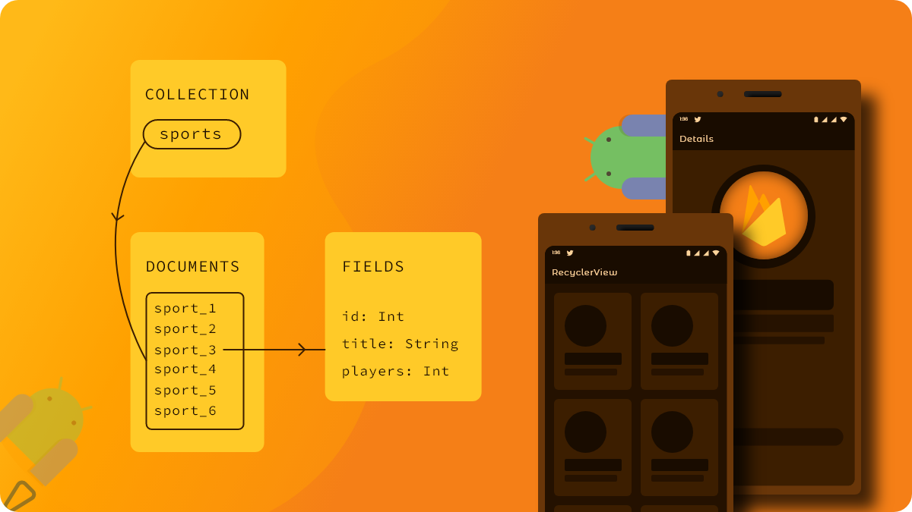

# Firebase Cloud Firestore Android

## :scroll: Description

Android app built to demonstrate on how to build `RecyclerView` using `Cloud Firestore` with
`Collections`, `Documents` and `Fields`.



```
App
\_____ MainActivity    ->   Display recycler view list using FirestoreAdapter.
\_____ DetailActivity  ->   Show user selected items details.   
```

An abstract class implements `EventListener` to listen `SnapshotQuery` changes.

```kotlin
abstract class FirestoreAdapter<VH : RecyclerView.ViewHolder>(
    private val query: Query
) : RecyclerView.Adapter<VH>(), EventListener<QuerySnapshot> {
    // Override class members here.
}
```

onEvent will be called with the new value or the error if an error occurred.

```kotlin
override fun onEvent(
    documentSnapshots: QuerySnapshot?,
    exception: FirebaseFirestoreException?
) {
    // Dispatch the event
    for (change in documentSnapshots!!.documentChanges) {
        // Snapshot of the changed document
        when (change.type) {
            // New Document was added to set of documents matching query.
            DocumentChange.Type.ADDED -> onDocumentAdded(change)
            // New document within the query was modified.
            DocumentChange.Type.MODIFIED -> onDocumentModified(change)
            // Removed, deleted, no longer matches the query.
            DocumentChange.Type.REMOVED -> onDocumentRemoved(change)
        }
    }
}
```

Create a snapshot variable for ArrayList of type DocumentSnapshot, this variable has all document
snapshots which we will work with.

```kotlin
private val snapshots = ArrayList<DocumentSnapshot>()
```

Each time changes are made we use their index for doing it correctly, and lastly we notify those
changes with index.

```kotlin
protected open fun onDocumentAdded(change: DocumentChange) {
    snapshots.add(change.newIndex, change.document)
    notifyItemInserted(change.newIndex)
}

protected open fun onDocumentModified(change: DocumentChange) {
    if (change.oldIndex == change.newIndex) {
        // Item changed but remained in same position
        snapshots[change.oldIndex] = change.document
        notifyItemChanged(change.oldIndex)
    } else {
        // Item changed and changed position
        snapshots.removeAt(change.oldIndex)
        snapshots.add(change.newIndex, change.document)
        notifyItemMoved(change.oldIndex, change.newIndex)
    }
}

protected open fun onDocumentRemoved(change: DocumentChange) {
    snapshots.removeAt(change.oldIndex)
    notifyItemRemoved(change.oldIndex)
}
```

Now we need functions which listens to those document changes, we call this functions in our
activity and fragments whenever we need to get data. Create a variable with name registration of
type ListenerRegistration which listens to the query using SnapshotListener.

```kotlin
var registration: ListenerRegistration? = null

open fun startListening() {
    if (registration == null) {
        registration = query.addSnapshotListener(this)
    }
}

open fun stopListening() {
    if (registration != null) {
        registration!!.remove()
        registration = null
    }

    snapshots.clear()
}
```

Listen to changes in `SnapshotQuery` from `Activity` in `onStart()` and `onStop()`.

```kotlin
open fun startListening() {
    if (registration == null) {
        registration = query.addSnapshotListener(this)
    }
}

open fun stopListening() {
    if (registration != null) {
        registration!!.remove()
        registration = null
    }

    snapshots.clear()
}
```

## Blog

These implementations are clearly demonstrated in
my [blog](https://developersbreach.com/firestore-collections-documents-recyclerview-android/).

## License

```
Copyright 2021 Rajasekhar K E

Licensed under the Apache License, Version 2.0 (the "License");
you may not use this file except in compliance with the License.
You may obtain a copy of the License at

    https://www.apache.org/licenses/LICENSE-2.0

Unless required by applicable law or agreed to in writing, software
distributed under the License is distributed on an "AS IS" BASIS,
WITHOUT WARRANTIES OR CONDITIONS OF ANY KIND, either express or implied.
See the License for the specific language governing permissions and
limitations under the License.
```
